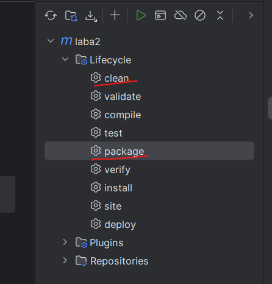
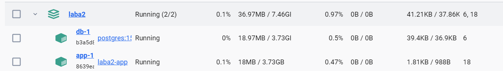
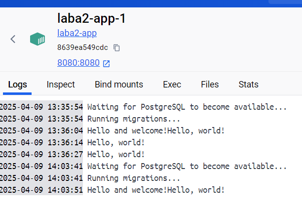
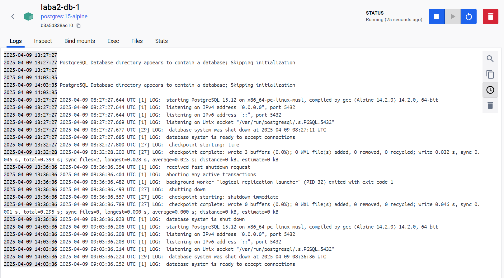

## Лабораторная работа №2

### Для запуска контейнера, необходимо:

1. Собрать java приложение:
    
    Через командную строку
    ```
   java mvn clean package
   ```
   Либо через среду разработки:
    
2. Запускаем docker-compose:
    ```
   docker-compose up
   ```

3. Если всё пройдет успешно, увидим, как отрабатывает контейнер через Docker Desktop:
    
    
    